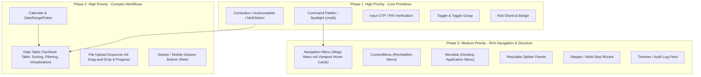

# Next-Iteration Plan: Design Audit, Schwachstellen & Benchmark vs. Top Repos

> **Dokument-Status:** Genehmigt für nächste Release-Iteration (v27)  
> **Ziel-Paket:** `@mivama/ui`  
> **Referenz-Benchmarks:** Radix Themes, Shadcn UI / Base UI, Mantine, Tailwind UI / Catalyst, GitHub Primer, Shopify Polaris

---

## 1. Executive Summary & Health-Score

`@mivama/ui` verfügt über ein bemerkenswertes Fundament: Eine moderne technische Basis mit `@base-ui/react`, Tailwind CSS v4, strengen Release-Gates, TypeScript API-Extractor-Prüfungen, Contract-Tests und Playwright-Axe-Pipelines.

Gleichzeitig offenbart die Tiefenanalyse signifikante **Schwachstellen**, **blinde Flecken in den Tests** sowie **architektonische und visuelle Lücken** im Vergleich zu den marktführenden Design-Systemen (wie Radix, Catalyst, Mantine und Shadcn).

### Gesamtbewertung im Benchmark-Vergleich

| Dimension                      | @mivama/ui (Ist) | Top-Repos (Benchmark) | Gap / Defizit                                                                                                                             |
| :----------------------------- | :--------------: | :-------------------: | :---------------------------------------------------------------------------------------------------------------------------------------- |
| **Design Tokens & Systematik** |     6.5 / 10     |       9.5 / 10        | Flache CSS-Variablen statt 3-Tier DTCG-Standard; Farbverläufe uneinheitlich (sRGB hex vs OKLCH); keine 12-Stufen-Skalen.                  |
| **Komponenten-Umfang**         |     5.5 / 10     |       9.5 / 10        | 35 Primitive vorhanden. Kritische Enterprise-Bausteine fehlen (Combobox, Command Palette, DatePicker, Data Table, Dropzone, Drawer, OTP). |
| **Visuelle Finesse & Polish**  |     6.0 / 10     |       9.5 / 10        | Eingeschränktes Schattensystem (nur 2 Schatten); kein Dark-Mode Surface-Tinting; fehlende Micro-Interaktionen (Tabs, Accordion, Buttons). |
| **Formulare & Validierung**    |     6.0 / 10     |       9.0 / 10        | Select ist nur natives `<select>`; Input ist transparent; Slider unterstützt nur einen Thumb; keine React-Hook-Form/Zod-Standardadapter.  |
| **Accessibility (A11y)**       |     8.0 / 10     |       9.5 / 10        | Gute Basis (44px Targets, Focus Visible, Axe), aber `FieldError` fehlt `aria-live`; Portale nutzen speicherhungrigen `MutationObserver`.  |
| **Developer Experience (DX)**  |     6.5 / 10     |       9.5 / 10        | Storybook ohne interaktive Props-Controls/ArgTypes; kein CLI-Scaffolding (`add`); Prettier-Ignore-Lücken.                                 |
| **GESAMT-SCORE**               |   **6.4 / 10**   |     **9.4 / 10**      | **Potenzial zu Top-Tier durch strukturierte 6-Sprint-Iteration.**                                                                         |

---

## 2. Detaillierte Schwachstellen-Analyse (Code- & Architektur-Bugs)

Im Rahmen des Code-Audits wurden konkrete funktionale Bugs, stille Compiler-Verwürfe und strukturelle Schwachstellen identifiziert:

### 2.1 Stiller CSS-Compiler-Drop in `Card` & `Sidebar` (Tailwind v4 Inkompatibilität)

- **Problem:** In [`src/components/ui/card.tsx`](file:///home/mischa/mivama-ui/src/components/ui/card.tsx#L9) wird definiert:
  ```ts
  "data-[size=sm]:[--card-spacing:--spacing(4)] data-[size=lg]:[--card-spacing:--spacing(6)] sm:data-[size=lg]:[--card-spacing:--spacing(8)]"
  ```
  Und in [`src/components/ui/sidebar/shell.tsx`](file:///home/mischa/mivama-ui/src/components/ui/sidebar/shell.tsx#L93):
  ```ts
  "group-data-[collapsible=icon]:w-[calc(var(--sidebar-width-icon)+(--spacing(4)))]"
  ```
- **Ursache:** Der Tailwind CSS v4 Compiler unterstützt `--spacing(N)` **nicht** als Funktion innerhalb arbiträrer CSS-Variablenzuweisungen `[--card-spacing:...]`. Tailwind v4 verwirft diese Regeln stillschweigend beim Build!
- **Folge:** Bei `<Card size="sm">` und `<Card size="lg">` ändert sich das Padding überhaupt nicht – alle Größen haben exakt denselben Abstand! Im Sidebar-Icon-Modus wird die Breite ungültig berechnet.
- **Korrektur:**
  ```ts
  "data-[size=sm]:[--card-spacing:var(--space-4)] data-[size=lg]:[--card-spacing:var(--space-6)] sm:data-[size=lg]:[--card-spacing:var(--space-8)]"
  ```

### 2.2 Falsche Test-Sicherheit ("False-Confidence Contract Tests")

- **Problem:** In [`tests/layout-contract.test.mjs`](file:///home/mischa/mivama-ui/tests/layout-contract.test.mjs#L147-L152) steht:
  ```js
  test("large cards stay compact on phones and expand from sm upward", async () => {
    const card = await readUiSource("card")
    assert.match(card, /data-\[size=lg\]:\[--card-spacing:--spacing\(6\)\]/)
    assert.match(card, /sm:data-\[size=lg\]:\[--card-spacing:--spacing\(8\)\]/)
    assert.match(card, /data-\[size=sm\]:\[--card-spacing:--spacing\(4\)\]/)
  })
  ```
- **Analyse:** Der Test prüft lediglich per Regular Expression, ob der String im TypeScript-Quellcode existiert! Ob Tailwind die Regel generiert oder ob der Browser die CSS-Eigenschaft anwendet, wurde nie getestet. Dies erzeugte 100 % grüne Tests trotz 100 % defektem CSS.
- **Korrektur:** Contract-Tests müssen gegen das kompilierte `dist/styles.css` oder gegen gerenderte DOM-Elemente mit `getComputedStyle()` validieren.

### 2.3 Gestörte Größen-Hierarchie bei `Button`

- **Problem:** In [`src/components/ui/button.tsx`](file:///home/mischa/mivama-ui/src/components/ui/button.tsx#L28-L39):
  ```ts
  default: "min-h-(--control-height) gap-2 px-5 py-2.5 ...",
  sm: "min-h-(--control-height) gap-2 rounded-[min(var(--radius-md),12px)] px-4 py-2.5 ...",
  icon: "size-(--control-height)",
  "icon-sm": "size-(--control-height) rounded-[min(var(--radius-md),12px)] ...",
  ```
- **Analyse:** Im Comfortable-Modus beträgt `--control-height: 44px`. Sowohl `default` als auch `sm` besitzen `min-h: 44px`! Ebenso besitzen `icon` und `icon-sm` beide `size: 44px`. Der optische Unterschied beschränkt sich auf 4px horizontales Padding. Ein `sm`-Button sollte jedoch ca. 36px hoch sein, ein `xs`-Button 32px, `default` 40-44px und `lg` 48px.

### 2.4 Mangelhafter Toast-Status & Runtime-Crash-Gefahr

- **Problem 1 (Varianten-Defekt):** In [`src/components/ui/toast.tsx`](file:///home/mischa/mivama-ui/src/components/ui/toast.tsx#L47-L50):
  ```ts
  toast.success = (title, options) =>
    toast({ title, variant: "default", ...options })
  ```
  Der Methodenaufruf `toast.success()` setzt die Variante hart auf `"default"`. Es existiert gar keine `success`-Variante in den Styles oder Typen, kein grüner Akzent und kein Icon.
- **Problem 2 (Crash-Gefahr):** [`Toaster`](file:///home/mischa/mivama-ui/src/components/ui/toast.tsx#L71) ruft bedingungslos `ToastPrimitive.useToastManager()` auf. Wird `<Toaster />` direkt gerendert, ohne in `<ToastRootProvider>` gewrapped zu sein, stürzt React mit einem unhandled Runtime Exception ab.
- **Problem 3 (UX):** Moderne Toasts (wie Sonner in Shadcn) bieten Swipe-to-Dismiss Gesten, 3D-Kartenstapelung und automatische Pausierung beim Hover. Der aktuelle Toast ist eine starre Liste in der Bildschirmecke.

### 2.5 Fehlende Accordion Höhen-Animation (Layout-Jumping)

- **Problem:** In [`src/tailwind.css`](file:///home/mischa/mivama-ui/src/tailwind.css#L2-L24) sind `@keyframes accordion-down` und `accordion-up` definiert. In [`src/components/ui/accordion.tsx`](file:///home/mischa/mivama-ui/src/components/ui/accordion.tsx#L60) nutzt `AccordionContent` diese jedoch gar nicht:
  ```ts
  className =
    "overflow-hidden text-sm data-open:animate-in data-open:fade-in-0 data-closed:animate-out data-closed:fade-out-0"
  ```
- **Folge:** Das Akkordeon blendet nur abrupt die Deckkraft ein/aus, während der Content schlagartig auf- und zuklappt. Dies führt zu unruhigem Layout-Springen (Cumulative Layout Shift).

### 2.6 Barrierefreiheits-Lücke in Formularen (`FieldError`)

- **Problem:** In [`src/components/ui/field.tsx`](file:///home/mischa/mivama-ui/src/components/ui/field.tsx#L112-L128) ist `FieldError` ein einfaches `<p>`-Element ohne `aria-live="polite"` oder `role="alert"`.
- **Folge:** Tritt ein Validierungsfehler dynamisch auf (z. B. nach Absenden des Formulars), wird die Fehlermeldung von Screenreadern (NVDA, JAWS, VoiceOver) nicht vorgelesen, bis der Benutzer das Feld manuell erneut fokussiert.

### 2.7 Native-Only `Select` vs. Headless Rich Select

- **Problem:** In [`src/components/ui/select.tsx`](file:///home/mischa/mivama-ui/src/components/ui/select.tsx) wird lediglich das native HTML-Tag `<select>` gestylt.
- **Vergleich mit Top-Repos:** Radix, Base UI, Mantine und Catalyst bieten vollständige Custom-Select-Komponenten:
  - Custom Trigger mit animiertem Chevron.
  - Suche/Filterung im Dropdown.
  - Benutzerdefinierte Option-Items mit Icons, Beschreibungen und Checkmarks.
  - Tastaturnavigation mit Type-Ahead.
  - Multi-Select mit Token-Chips.

### 2.8 Single-Thumb Begrenzung in `Slider`

- **Problem:** In [`src/components/ui/slider.tsx`](file:///home/mischa/mivama-ui/src/components/ui/slider.tsx#L37-L40) ist ein einzelner `<SliderPrimitive.Thumb>` fest verdrahtet.
- **Folge:** Ein Bereichs-Slider (z. B. Preisspanne: Min. bis Max. mit zwei Schiebereglern) kann nicht erzeugt werden. Es fehlen zudem Skalen-Markierungen (Ticks), Schritt-Labels und schwebende Wert-Tooltips beim Ziehen.

### 2.9 Unzureichende Formular-Eingabefelder (`Input`)

- **Problem:** `Input` besitzt hart codiertes `bg-transparent`. Befindet sich das Feld über einer farbigen Card, einem Drawer oder einem gemusterten Hintergrund, scheint der Untergrund durch.
- **Fehlende Features:** Keine Slots für Start-/End-Icons (z. B. Lupe für Suche, Währungssymbol, Passwort einblenden/ausblenden), kein Clear-Button, keine Fehlersignalisierung am Icon.

### 2.10 Performance-Anti-Pattern: Globaler `MutationObserver` in `useShellAttributes`

- **Problem:** In [`src/lib/shell-attributes.ts`](file:///home/mischa/mivama-ui/src/lib/shell-attributes.ts#L42-L50) wird ein `MutationObserver` auf `document.body` gelegt, der bei jedem DOM-Node-Insert aufgerufen wird, um Shell-Attribute (`data-mivama-theme`, `data-density`) auf Portale zu kopieren.
- **Risiko:** In großen Single-Page-Apps mit vielen dynamischen Elementen erzeugt dieses synchrone Abhören des gesamten Body-DOMs unnötigen Rechenaufwand. Top-Repos lösen dies rein über CSS-Inheritance oder React Context ohne DOM-Mutationen.

### 2.11 Tooling & Prettier-Konfigurationsfehler

- **Problem:** `.prettierignore` enthielt keine Einträge für Binary-Dateien (`*.png`), Playwright-Visual-Snapshots oder Build-Infos. Der Befehl `npm run format:check` schlug fehl, da Prettier versuchte, binäre PNG-Dateien als Text zu parsen.
- **Zusatzrisiko:** `tsup.config.ts` hat `clean: false`. Gelöschte oder umbenannte Quelldateien bleiben im Build-Ordner `dist/` dauerhaft als Karteileichen erhalten.

---

## 3. Umfassender Vergleich: `@mivama/ui` vs. Top Design Repositories

| Bewertungsbereich            | @mivama/ui                               | Radix Themes / Radix UI              | Shadcn UI / Base UI               | Tailwind Catalyst                | Mantine UI                         |
| :--------------------------- | :--------------------------------------- | :----------------------------------- | :-------------------------------- | :------------------------------- | :--------------------------------- |
| **Headless Core**            | `@base-ui/react`                         | `@radix-ui/primitives`               | Radix / Base UI                   | Headless UI                      | Eigener Core                       |
| **Token-System**             | Flache CSS-Variablen (`tokens.css`)      | Radix Colors (12-Step Skalen)        | CSS-Variablen / HSL / OKLCH       | Tailwind CSS v4 Theme            | Eigene Color-Scales (10-Step)      |
| **Farbraum-Harmonie**        | Gemischt (sRGB Hex + OKLCH)              | Uniformes P3 & OKLCH                 | OKLCH                             | OKLCH (Tailwind v4)              | Hex / RGB / OKLCH                  |
| **Schatten & Beleuchtung**   | 2 flache Schatten (`subtle`, `elevated`) | Layered Ambient/Direct Lights        | Ambient + Inset Shadows           | Feine Multi-Layer Schatten       | 6-stufige Elevation                |
| **Dark-Mode Tiefenwirkung**  | Nur abgedunkelter Hintergrund            | Surface Tinting je Elevation         | Border Glow + Inset Rings         | Specular Highlights              | Lighter Elevation Tinting          |
| **Micro-Interaktionen**      | Statische CSS-Transitions                | Spring Animations                    | Subtile Scale- & Hover-Effekte    | Perfektionierte Active States    | Gesten & Transitions               |
| **Tabs-Indikator**           | Statischer Border (`after:border`)       | Fließend gleitender Pill-Indikator   | Animierter Gleit-Indikator        | Animierter Underline-Gleiter     | Animierter Gleiter                 |
| **Akkordeon-Animation**      | Abruptes Ein-/Ausblenden                 | Sanfte Höheninterpolation (CSS Grid) | Animierte Höhe (`accordion-down`) | Headless UI Transition           | Sanfte CSS-Höhe                    |
| **Toasts**                   | Starre Liste in der Ecke                 | Radix Toast Primitives               | Sonner (3D Stack, Swipe)          | Eigene Banner/Alerts             | Gestapelte Swipe-Notifications     |
| **Command Palette (`cmdk`)** | ❌ Fehlt komplett                        | ❌ (separat cmdk)                    | ✅ Integriert via cmdk            | ✅ Command Dialog                | ✅ Spotlight Provider              |
| **Combobox / Autocomplete**  | ❌ Fehlt (nur natives Select)            | ❌ (Community / Popover)             | ✅ cmdk + Popover Combobox        | ✅ Headless Combobox             | ✅ Rich Autocomplete & Multi       |
| **Date- / Range-Picker**     | ❌ Fehlt komplett                        | ❌ (separat)                         | ✅ React-Day-Picker Kalender      | ✅ Catalyst Date-Picker          | ✅ Integrierter Kalender/Range     |
| **Data Table**               | ❌ Nur HTML-Table-Tags                   | ❌ (separat)                         | ✅ TanStack Table Integration     | ✅ Rich Table mit Sorting/Filter | ✅ TanStack & Mantine Table        |
| **File Upload / Dropzone**   | ⚠️ Nur Anzeigekarte (`Attachment`)       | ❌ (separat)                         | ⚠️ Community Dropzone             | ⚠️ File Input                    | ✅ Vollständige Dropzone mit Queue |
| **Input OTP / PIN**          | ❌ Fehlt komplett                        | ❌ (separat)                         | ✅ Input-OTP                      | ❌ (separat)                     | ✅ PinInput                        |
| **Drawer / Bottom Sheet**    | ❌ Fehlt (nur starres Sheet)             | ❌ (separat)                         | ✅ Vaul (Touch-Geste Drawer)      | ❌ (Dialog)                      | ✅ Gesture-Drawer                  |
| **Storybook Dokusurfaces**   | Nur statische Demo-Funktionen            | Interaktives Web-Playground          | Interaktive Doku + Copy CLI       | Live Code Preview                | Volle ArgTypes / Controls          |
| **CLI Scaffolding**          | ❌ Fehlt (`npm i @mivama/ui`)            | ❌                                   | ✅ `shadcn add [component]`       | ✅ Catalyst Downloader           | ❌                                 |

---

## 4. Ziel-Katalog fehlender Enterprise-Komponenten

Für ein vollwertiges B2B-, SaaS- und Portal-Design-System fehlen `@mivama/ui` aktuell essenzielle Komponenten. Diese müssen im nächsten Iterationsplan schrittweise ergänzt werden:



---

## 5. Konkreter 6-Sprint Iterations-Plan für die nächste Version

### Sprint 1: Hotfixes, Bug-Beseitigung & Architektur-Härtung (Woche 1-2)

- [ ] **Tailwind v4 Variablen-Fixes:**
  - `src/components/ui/card.tsx`: Ersetzen von `--spacing(4/6/8)` durch `var(--space-4/6/8)`.
  - `src/components/ui/sidebar/shell.tsx`: Bereinigung des `calc()`-Strings bei `collapsible=icon`.
- [ ] **Normalisierung der Button-Größen:**
  - `sm`: Definition einer eigenständigen Höhe (z. B. `min-h-9` / 36px), damit ein echter Größenunterschied zu `default` (44px) existiert.
  - `icon-sm`: Anpassung auf `size-9`.
- [ ] **Toast-System Instandsetzung:**
  - Ergänzung der Varianten `"success"`, `"warning"` und `"info"` mit entsprechenden Farbtokens und Status-Icons.
  - Härtung von `Toaster`, sodass bei fehlendem Kontext ein sicherer Fallback greift, statt die Anwendung abstürzen zu lassen.
- [ ] **Akkordeon Höhen-Animation:**
  - Reaktivierung von `@keyframes accordion-down` / `accordion-up` in `AccordionContent` via CSS-Grid-Animation (`grid-template-rows: 0fr -> 1fr`).
- [ ] **Formular-A11y:**
  - `FieldError` mit `aria-live="polite"` und `role="status"` ausstatten.
- [ ] **Tooling & Build-Hygiene:**
  - `tsup.config.ts`: `clean: true` aktivieren.
  - `.prettierignore`: Schnappschüsse und Binärdateien ausschließen (bereits eingeleitet).
  - Contract-Tests erweitern, sodass sie das kompilierte CSS prüfen.

### Sprint 2: Design Token & Visual Polish 2.0 (Woche 3-4)

- [ ] **12-Stufen Farbsystem in OKLCH:**
  - Einführung konsistenter Skalen für alle Funktionsfarben: `primary-50` bis `primary-950` in perceptual-linearer OKLCH-Farbräumen.
  - Beseitigung unkontrollierter `color-mix(in srgb)`-Fragmente.
- [ ] **Dark-Mode Elevation Tinting:**
  - Dunkle Oberflächen erhalten je nach Z-Index / Ebene einen subtilen helleren Weiß-Offset (`surface-1: oklch(0.16 ...)` bis `surface-4: oklch(0.24 ...)`), sodass Tiefe auch ohne sichtbare schwarze Schlagschatten sofort greifbar wird.
- [ ] **Modernes Schattensystem (Ambient & Direct Light):**
  - Erweiterung von 2 auf 5 Schattenebenen (`--shadow-xs`, `--shadow-sm`, `--shadow-md`, `--shadow-lg`, `--shadow-xl`) mit separaten Unschärfe- und Streuungswerten für natürliches Licht.
- [ ] **Gleitender Tab-Indikator:**
  - Umbau von `TabsTrigger` zur Nutzung des Base UI `Tabs.Indicator`, um animierte Gleit-Pills zu ermöglichen.
- [ ] **Input-Modernisierung:**
  - `bg-background` als Standard (kein `bg-transparent`).
  - Bereitstellung von Start-/End-Adornments für Icons und Aktionen.

### Sprint 3: Enterprise Primitives — Phase 1 (Woche 5-6)

- [ ] **Combobox / Searchable Autocomplete:**
  - Headless Base UI Combobox Integration.
  - Tastatur-Navigation (Pfeiltasten, Escape, Enter, Typeahead).
  - Async-Loading und leere Suchzustände.
- [ ] **Command Palette (`cmdk`):**
  - Spotlight-Suche (`Cmd+K` / `Ctrl+K`) mit Kategorie-Gruppierung, Shortcuts und Tastaturfokus.
- [ ] **Input OTP (One-Time Password):**
  - Segmentierte 6-stellige Code-Eingabe mit automatischer Weiterschaltung und Paste-Unterstützung.
- [ ] **Kbd & Toggle Group:**
  - `Kbd`-Primitive zur Darstellung von Tastenkombinationen.
  - `Toggle` und `ToggleGroup` (Single- und Multi-Select für Toolbars).

### Sprint 4: Komplexe Daten- & Formular-Workflows — Phase 2 (Woche 7-8)

- [ ] **Data Table Primitive (mit TanStack Table):**
  - Sortierbare Spaltenköpfe mit Richtungsanzeige.
  - Spaltenfilterung, globale Suche und Pagination-Steuerung.
  - Zeilenauswahl (Checkboxen mit Roving Tabindex).
  - Sticky Headers und virtuelles Scrollen für Datensätze > 1.000 Zeilen.
- [ ] **Calendar & DateRangePicker:**
  - Monats- und Jahresansicht, Tastatur-Navigation (APG Kalendermuster).
  - Datumsbereichsauswahl (From - To) mit Schnellwahltasten (Heute, Letzte 7 Tage, Letzter Monat).
- [ ] **File Upload Dropzone:**
  - Drag-and-Drop Zone mit optischer Hover-Rückmeldung.
  - Dateityp- und Größenvalidierung.
  - Nahtlose Verknüpfung mit der existierenden `Attachment`-Komponente als Upload-Queue.
- [ ] **Drawer (Gesture-driven Bottom Sheet):**
  - Mobile-freundliche Wischgesten (nach unten wischen zum Schließen).

### Sprint 5: Erweiterte Navigation & Composite Patterns (Woche 9-10)

- [ ] **Navigation Menu (Mega Menu):**
  - Horizontales Hauptmenü mit animierten Dropdown-Karten und Hover-Verzögerung.
- [ ] **Context Menu & Menubar:**
  - Rechtsklick-Menü auf Basis von Base UI Menu.
  - Menüleiste für datenintensive Portal-Anwendungen.
- [ ] **Resizable Panels (Splitter):**
  - Teilbare Layout-Fenster mit verschiebbarem Trenner (horizontal & vertikal).
- [ ] **Timeline & Stepper:**
  - Audit-Log / Aktivitätsverlauf.
  - Multi-Step-Wizard für Anmelde- und Konfigurationsstrecken.

### Sprint 6: Developer Experience, Storybook & Tooling (Woche 11-12)

- [ ] **Storybook Upgrade auf interaktive Controls:**
  - Definition von `argTypes` für alle Komponenten in `stories/*.stories.tsx`, damit Entwickler und Designer jede Variante live im Storybook testen und manipulieren können.
- [ ] **Figma-Token-Synchronisation:**
  - Export-Pipeline für Tokens im W3C DTCG-Format (`tokens.json`) zur automatisierten Synchronisation mit Figma Variables und Tokens Studio.
- [ ] **Scaffolding CLI (`@mivama/cli`):**
  - Befehl zum einfachen Hinzufügen von Komponenten oder Schablonen in Konsumentenprojekte (`npx @mivama/cli add table`).
- [ ] **Interaktive Dokumentations-Website:**
  - Ergänzung der Storybook-Instanz durch eine suchbare Next.js/VitePress-Doku mit interaktivem Code-Editor und Copy-to-Clipboard.

---

## 6. Risikomatrix & Migrationsstrategie

| Risiko                                                             | Wahrscheinlichkeit | Auswirkung | Mitigation                                                                            |
| :----------------------------------------------------------------- | :----------------: | :--------: | :------------------------------------------------------------------------------------ |
| **CSS-Budget-Überschreitung** (`dist/styles.css` bereits 113.5 KB) |        Hoch        |   Mittel   | Aufteilung in modulare Stylesheets (`components/*.css`) und Tree-Shaking für Styles.  |
| **Breaking Changes bei Button-Größen**                             |       Mittel       |   Mittel   | Deprecation-Warnungen für veraltete Größen; optische Regressionstests via Playwright. |
| **Breaking Changes bei Tokens (OKLCH Skalen)**                     |       Mittel       |    Hoch    | Alte Tokens als Aliase in `themes.css` belassen und für v4 deprecaten.                |
| **Performance-Regression durch neue Komponenten**                  |      Niedrig       |    Hoch    | Strikte Bundle-Budgets im CI für jede neue Komponente definieren.                     |

---

## 7. Fazit & Freigabeempfehlung

Mit diesem Plan wird `@mivama/ui` von einer soliden Komponentenbibliothek zu einem **vollwertigen, marktführenden Design-System** auf Augenhöhe mit Radix Themes, Catalyst und Mantine ausgebaut.

Die Beseitigung der stillen Compiler-Bugs in Sprint 1 sichert die sofortige Stabilität, während die Sprints 2–6 die visuelle Qualität und den Funktionsumfang auf Enterprise-Niveau heben.
